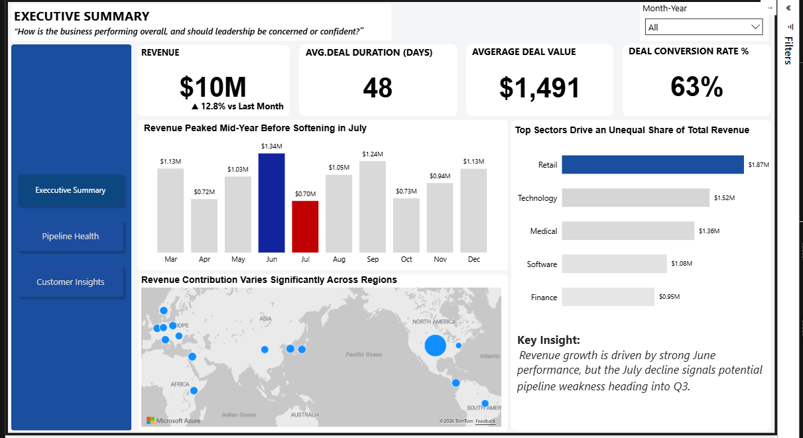

# CRM sales pipeline analysis

**Question:** How much revenue has closed, where do opportunities stall, and which accounts and sectors deserve closer attention?

This Power BI project models [Maven Analytics’ CRM Sales Opportunities sample](https://mavenanalytics.io/data-playground/crm-sales-opportunities), which represents a **fictitious** computer-hardware company, alongside account, product and sales-team data. The four source tables in this repository contain 8,800 opportunities, 85 accounts, 35 sales-team records and 7 products. The dashboard has executive, pipeline-health and customer-insight views.

## Dashboard screenshots

Open the full-size screenshots from the Power BI report:

- [Executive summary dashboard](images/executive-summary.png)
- [Pipeline health dashboard](images/pipeline-health.png)
- [Customer insights dashboard](images/customer-insights.png)
- [Data model screenshot](images/data-model.png)

## Approach

1. Join opportunities to accounts, products and sales teams using their shared names or identifiers; check unmatched records before interpreting segments.
2. Distinguish won revenue from the value of open opportunities, and calculate conversion only among closed deals.
3. Compare deal stages, sales-cycle duration, region and sector in Power BI. The model screenshot and source data are included for review.

## Findings from the supplied data

- **$10,005,534 closed revenue** across 4,238 won opportunities. This is historical *won revenue*, not the value of the currently open pipeline.
- **63.1% closed-deal win rate:** 4,238 won / (4,238 won + 2,473 lost). The 2,089 engaging and prospecting opportunities are excluded from this denominator.
- 1,589 opportunities are engaging and 500 are prospecting; examine their age and value before calling them stalled or forecastable.

## Decision use and limits

Use the views to review stage progression, sales-cycle outliers and account concentrations. A dashboard can surface candidates for follow-up; it does not establish that a particular action improved revenue or forecasting. Validate the definition of every KPI before use; these fictitious-company records cannot demonstrate measured impact for a live business.

## Files

| File | Purpose |
| --- | --- |
| [`powerBI_final.pbix`](powerBI_final.pbix) | Editable Power BI report |
| [`sales_pipeline.csv`](sales_pipeline.csv), [`accounts.csv`](accounts.csv), [`products.csv`](products.csv), [`sales_teams.csv`](sales_teams.csv) | Source tables |
| [`data_dictionary.csv`](data_dictionary.csv) | Field descriptions |
| [`images/`](images/) | Executive, pipeline, customer and model previews |
| [`Sales Pipeline Data Analysis and Modeling Documentation.docx`](archive/Sales%20Pipeline%20Data%20Analysis%20and%20Modeling%20Documentation.docx) | Process documentation |
| [`Customer Relationship Management Project Report.pptx`](archive/Customer%20Relationship%20Management%20Project%20Report.pptx) | Presentation |

To explore, open the `.pbix` file in Power BI Desktop. The CSVs and data dictionary allow the measures and relationships to be checked independently.

**Analyst:** [Chukwuemeka Ogo](https://mikkymo.github.io/portfolio/) · [LinkedIn](https://www.linkedin.com/in/ogochukwuemeka/)
