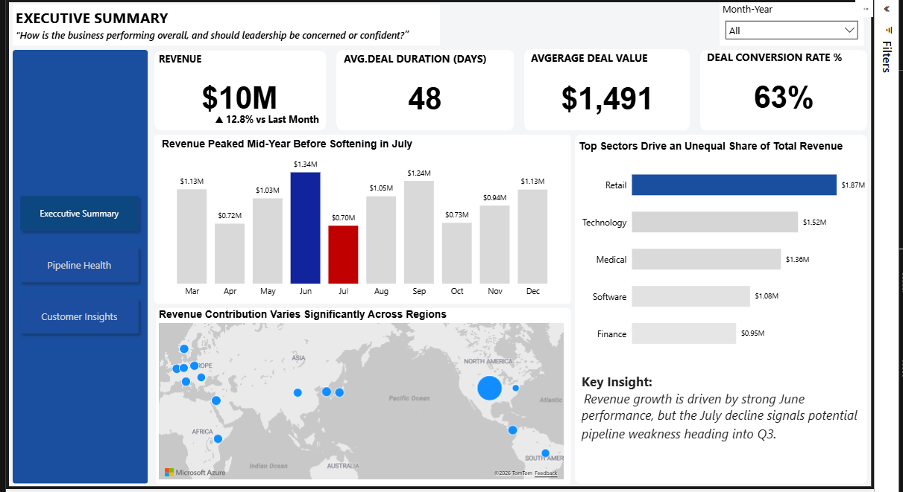

# CRM Sales Pipeline Analysis
### Sales performance and opportunity progression

A sales-management case study using four related tables from Maven Analytics’ fictitious computer-hardware company. The report separates completed sales from open opportunities and supports investigation of pipeline progression.

**Tools:** Power BI · DAX · Excel  
**Analyst:** Chukwuemeka Ogo

**[View dashboards](docs/dashboard-gallery.md)** · [Read analytical notes](docs/analytical-notes.md)

## Business question

How much revenue has been won, how are opportunities progressing, and which accounts require closer attention?

## Dashboard preview

[Explore all dashboard views and version notes →](docs/dashboard-gallery.md)

## Key findings

| Metric | Result |
| --- | ---: |
| Opportunity records | 8,800 |
| Won revenue | $10,005,534 |
| Won opportunities | 4,238 |
| Lost opportunities | 2,473 |
| Closed-deal win rate | 63.1% |
| Open opportunities | 2,089 |

The closed-deal win rate is won ÷ (won + lost). Open opportunities are excluded because their outcomes are not yet known.

## Decision use

1. Review the age, stage, and potential value of open opportunities before prioritising follow-up.
2. Investigate account concentration and differences in sales-cycle duration.
3. Use consistent KPI definitions when comparing sales teams or segments.

These recommendations identify next steps; they do not represent measured business impact.

## Approach

Connect opportunities with accounts, products, and sales teams. Check relationship keys and unmatched records before interpreting segments. Define won revenue separately from open pipeline value and compare deal stages and sales-cycle patterns.

## Explore the project

| Resource | Purpose |
| --- | --- |
| [Power BI report](powerBI_final.pbix) | Power BI report |
| [Opportunity data](sales_pipeline.csv) | Opportunity data |
| [Account data](accounts.csv) | Account data |
| [Product data](products.csv) | Product data |
| [Sales-team data](sales_teams.csv) | Sales-team data |
| [Data dictionary](data_dictionary.csv) | Data dictionary |
| [Dashboard gallery](docs/dashboard-gallery.md) | Full-size views and version context |
| [Analytical notes](docs/analytical-notes.md) | Methodology, metric definitions, and limitations |

## Scope and limitations

The dataset represents a fictitious company. Won revenue is historical revenue, not open pipeline value. Open status alone does not establish that a deal is stalled, and the project does not demonstrate realised revenue or forecasting improvements.

---

[Portfolio](https://mikkymo.github.io/portfolio/) · [LinkedIn](https://www.linkedin.com/in/ogochukwuemeka/)
